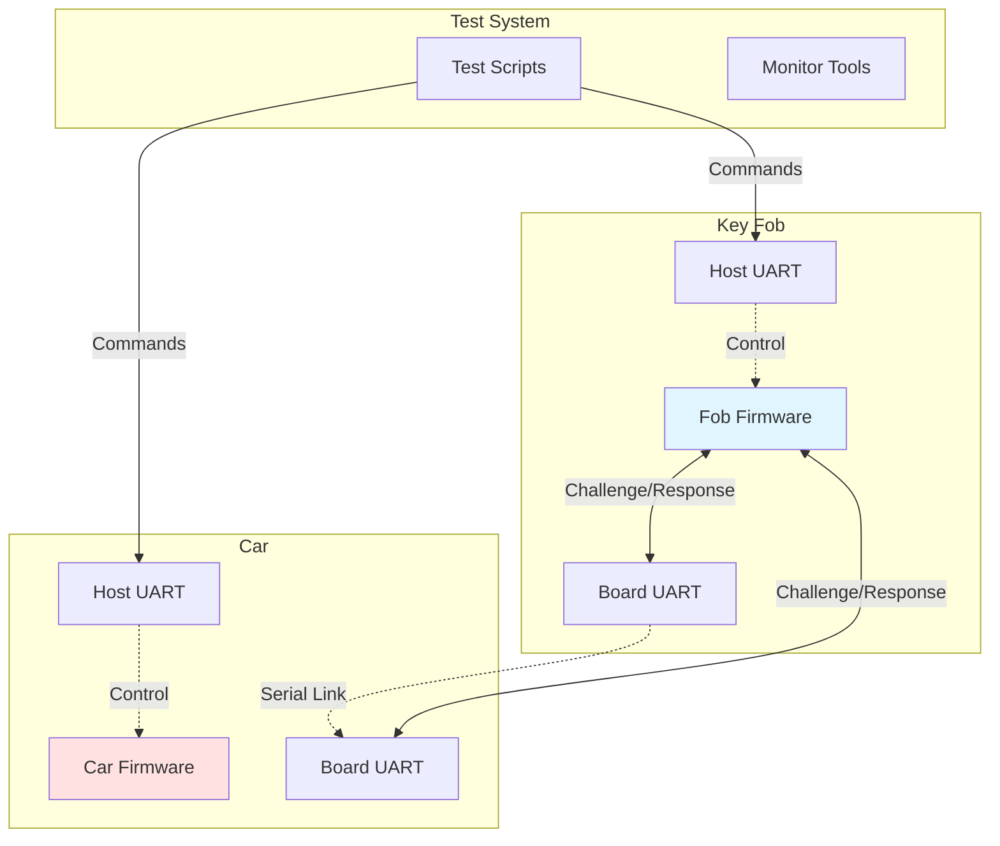
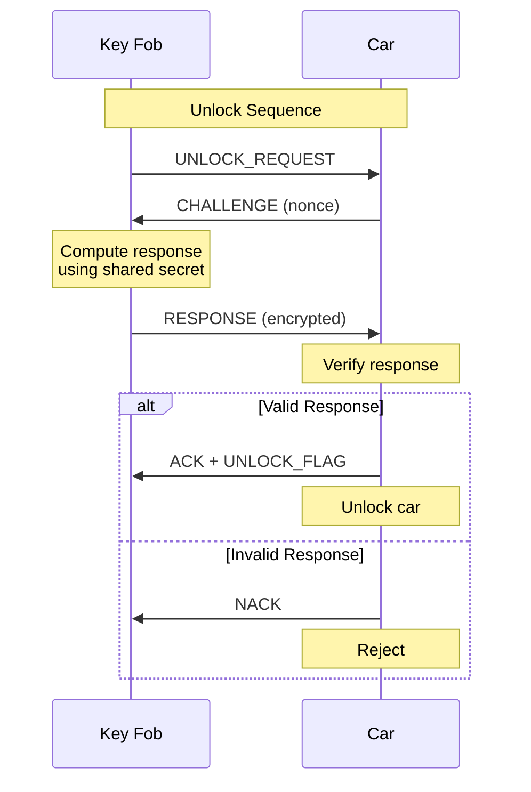
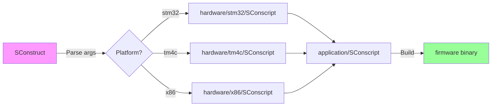
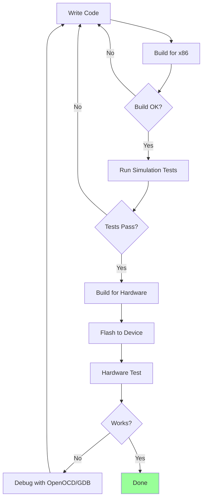

# eCTF Hardware Hacking Demo

> **Companion Code** for DigiKey article: [How Hardware Gets Hacked (Part 3)](link-to-article)

Embedded security demonstration using car key fob authentication systems across multiple hardware platforms.

## System Architecture



## Hardware Platforms

```
┌─────────────────────────────────────────────────────────┐
│  Supported Platforms                                    │
├─────────────┬──────────────┬──────────────┬─────────────┤
│   STM32F4   │   TM4C123    │     x86      │   Status    │
├─────────────┼──────────────┼──────────────┼─────────────┤
│ ARM Cortex  │ ARM Cortex   │ Simulation   │             │
│    M4       │      M4      │              │             │
│             │              │              │             │
│ ST-Link     │ Stellaris    │ Virtual      │             │
│ Debugger    │ ICDI         │ Serial       │             │
│             │              │              │             │
│ BlackPill   │ EK-TM4C123   │ Linux/Mac/   │             │
│   Board     │    GXL       │   WSL2       │             │
└─────────────┴──────────────┴──────────────┴─────────────┘
```

## Project Structure

```
code/
├── application/          # Platform-independent firmware logic
│   ├── source/
│   │   ├── car.c        # Car authentication & features
│   │   ├── fob.c        # Key fob pairing & unlock
│   │   └── messages.c   # Protocol message handlers
│   └── include/         # Shared headers
│
├── hardware/            # Platform-specific implementations
│   ├── stm32/          # STM32F4 HAL & startup
│   ├── tm4c/           # TM4C123 drivers
│   ├── x86/            # Desktop simulation
│   └── include/        # Platform abstraction (UART, flash)
│
├── tools/              # Python utilities
│   ├── simulate.py     # Virtual environment manager
│   ├── monitor.py      # Serial monitor
│   ├── enable.py       # Feature enablement tool
│   └── *_gen_secret.py # Secret generation
│
├── testing/            # Pytest test suite
│   ├── test.py         # Protocol tests
│   └── conftest.py     # Fixtures
│
└── docs/               # Setup guides (Mac, WSL)
```

## Authentication Protocol



## Build System Flow



**Build Parameters:**
```bash
scons platform={stm32|tm4c|x86} role={car|paired_fob|unpaired_fob} id=<CAR_ID> [pin=<PIN>]
```

## Quick Start

### 1. Setup Environment

```bash
# Install dependencies (see platform-specific setup below)
python3 -m venv hhghVenv
source hhghVenv/bin/activate  # Windows WSL: same command
pip install -r requirements.txt

# Verify setup
./test_platform.py
```

### 2. Build Firmware

```bash
# Build car firmware for STM32
scons platform=stm32 role=car id=12345 \
    unlock_flag="FLAG{unlocked}" \
    feature1_flag="FLAG{heated_seats}"

# Build paired fob for x86 simulation
scons platform=x86 role=paired_fob id=12345 pin=123456
```

### 3. Run Simulation

```python
# Using Python simulation environment
from tools.simulate import SimulationEnvironment

with SimulationEnvironment("car_x86", "fob_x86") as env:
    fob = env.primary
    car = env.secondary

    # Send unlock command
    fob.send_command("unlock")
    response = car.read_until("FLAG")
```

## Platform-Specific Setup

<details>
<summary><b>Linux/WSL2</b> (recommended for Windows users)</summary>

```bash
# Install ARM toolchain
sudo apt install gcc-arm-none-eabi openocd

# Add user to dialout group (for USB devices)
sudo usermod -a -G dialout $USER

# For WSL: Attach USB devices
# See docs/setup-windows-wsl.md for usbipd setup
```
</details>

<details>
<summary><b>macOS</b></summary>

```bash
# Install dependencies via Homebrew
brew install arm-none-eabi-gcc openocd libusb

# For xterm (x86 console UI)
brew install --cask xquartz
```

See `docs/setup-mac.md` for detailed instructions.
</details>

## Tools Usage

### Device Monitor
```bash
# Monitor serial output from connected device
python tools/monitor.py --device /dev/ttyUSB0

# Monitor simulated devices
python tools/monitor.py --device /dev/pts/3
```

### Feature Enablement
```bash
# Enable a feature on the car
python tools/enable.py --car-id 12345 --feature 1
```

### Secret Generation
```bash
# Generate shared secrets
python tools/car_gen_secret.py --id 12345
python tools/fob_gen_secret.py --id 12345 --pin 123456
```

## Testing

```bash
# Run full test suite
pytest testing/

# Run with verbose output
pytest -v testing/test.py

# Run specific test
pytest testing/test.py::test_unlock_valid_fob
```

## Communication Architecture

```
┌───────────────────────────────────────────────┐
│            Host Computer                      │
│  ┌─────────────────┐  ┌─────────────────┐   │
│  │  Monitor/Test   │  │  Monitor/Test   │   │
│  │    Scripts      │  │    Scripts      │   │
│  └────────┬────────┘  └────────┬────────┘   │
└───────────┼────────────────────┼─────────────┘
            │ HOST_UART          │ HOST_UART
            │ (control)          │ (control)
         ┌──▼──────────┐      ┌──▼──────────┐
         │   Key Fob   │      │     Car     │
         │             │◄────►│             │
         │  Firmware   │ BOARD│  Firmware   │
         │             │ UART │             │
         └─────────────┘ (RF) └─────────────┘
```

- **HOST_UART**: Command/control interface (115200 baud)
- **BOARD_UART**: Inter-device communication (115200 baud)

## Device Roles

| Role | Description | Requires ID | Requires PIN |
|------|-------------|-------------|--------------|
| `car` | Car controller | Yes | No |
| `paired_fob` | Pre-paired key fob | Yes | Yes |
| `unpaired_fob` | Factory fob (pairs at runtime) | No | No |

## Firmware Commands

```
Fob Commands (via HOST_UART):
  unlock           - Request car unlock
  start            - Start car (after unlock)
  enable <hex>     - Enable feature on car
  pair <pin>       - Pair unpaired fob (unpaired_fob only)

Car Commands (via HOST_UART):
  None (car responds to fob requests via BOARD_UART)

Common Responses:
  OK: <data>       - Success with optional data
  ERROR: <reason>  - Failure with reason
```

## Development Workflow



## Troubleshooting

**Build fails with "PLATFORM not set"**
- Ensure you specify `platform=` and `role=` arguments to scons

**Serial port permission denied**
- Linux: Add user to dialout group: `sudo usermod -a -G dialout $USER`
- macOS: Ports should work by default

**x86 simulation can't create virtual serial ports**
- Install: `pip install PyVirtualSerialPorts`
- Linux: Ensure `/dev/pts/` is accessible

**OpenOCD can't find device**
- Check USB connection
- WSL: Use `usbipd` to attach device (see `docs/setup-windows-wsl.md`)
- Verify device appears in `lsusb` (Linux) or Device Manager (Windows)

## License

MIT License - Copyright (c) 2023 The MITRE Corporation (base eCTF code)

Educational/demonstration purposes only. Not for production use.

---

**For setup instructions, see:**
- `docs/setup-windows-wsl.md` - Windows WSL2 setup
- `docs/setup-mac.md` - macOS setup
- `test_platform.py` - Platform compatibility checker
