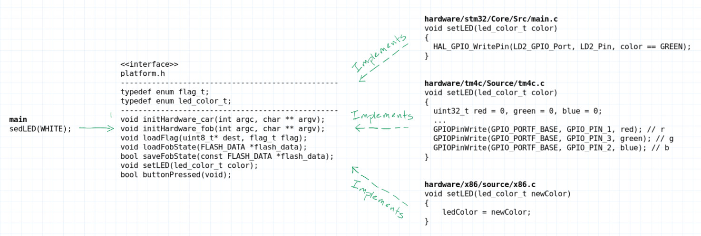
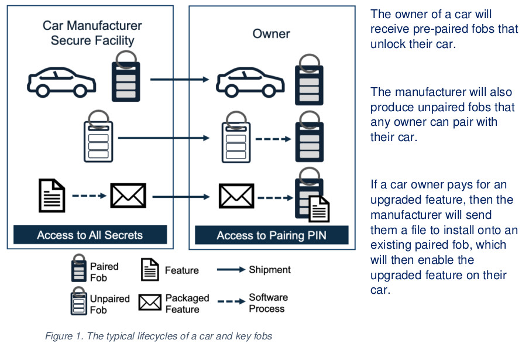
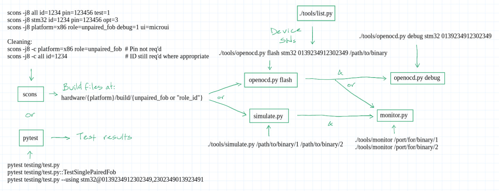
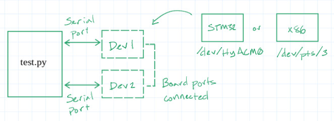

# eCTF Hardware Hacking Demo

> **Companion code for:** ["How Hardware Gets Hacked" article series](https://www.digikey.com/en/maker/search-results?t=Nathan%20Jones%20How%20Hardware%20Gets%20Hacked&f=1981359301) on Maker.io

This project demonstrates iterative attacks and defenses for embedded systems using the 2023 MITRE eCTF competition as a foundation. Built from scratch to support multi-platform development (STM32, TM4C, simulation), automated testing, and simulation without Docker dependencies.

**Article Series:**
- [Part 1: Introduction to the 2023 MITRE eCTF](https://www.digikey.com/en/maker/blogs/2025/how-hardware-gets-hacked-part-1)
- [Part 2: On-boarding](https://www.digikey.com/en/maker/blogs/2026/how-hardware-gets-hacked-part-2-on-boarding)
- [Part 3: Adopting the Attacker Mindset](https://www.digikey.com/en/maker/blogs/2026/how-hardware-gets-hacked-part-3-adopting-the-attacker-mindset)
- [Part 4: Memory Protections](https://www.digikey.com/en/maker/blogs/2026/how-hardware-gets-hacked-part-4-memory-protections)
- [Part 5: Replay Attacks](https://www.digikey.com/en/maker/blogs/2026/how-hardware-gets-hacked-part-5)

## Project Structure

```
./
├── application/                      # Platform-independent firmware
│   ├── source/                       # car.c, fob.c, messages.c, host_msg_helpers.c
│   ├── include/                      # Shared headers
│   ├── packages/                     # Feature package definitions
│   └── SConscript                    # Application build rules
│
├── hardware/                         # Platform-specific implementations
│   ├── include/                      # platform.h and uart.h (abstraction layer)
│   ├── source/                       # platform_common.c (abstraction layer)
│   ├── stm32/                        # STM32F4 HAL & drivers
│   ├── tm4c/                         # TM4C123 drivers
│   └── sim/                          # Desktop simulation layer
│
├── libraries/                        # External libraries used in the project
│   ├── tiny-AES-c/                   # Provides AES operations
│   └── tiny-AES-CMAC-c/              # Implements AES-CMAC using another AES library
│
├── tools/                            # Python utilities
│   ├── simulate.py                   # x86 simulation environment
│   ├── openocd.py                    # Flash & debug wrapper
│   ├── monitor.py                    # Serial monitor
│   ├── list.py                       # Device enumeration
│   ├── package.py                    # Package a car feature
│   ├── icdi_unlock.py                # Script to unlock a locked TM4C device
│   ├── car_gen_secret.py             # Script to create "secrets.h" for a car
│   ├── fob_gen_secret.py             # Script to create "secrets.h" for a fob (paired or unpaired)
│   └── enable.py                     # Feature enablement
│
├── testing/                          # Automated test suite
│   ├── functional_tests.py           # Protocol tests
│   ├── security_tests.py             # Security tests
│   ├── conftest.py                   # pytest fixtures & device mgmt
│   └── protocol.py                   # Test message helpers
│
├── setup/                            # Platform setup guides
├── secrets/                          # Secret generation & storage
│   └── secrets.json                  # Record of car keys and fob IDs
└── SConstruct                        # Build system entry point
```

### Hardware Abstraction

The project uses a clean abstraction layer (`hardware/include/platform.h` and `hardware/include/uart.h`) that allows the same application code to run on multiple platforms:



```c
// platform.h defines the non-UART interface
void initHardware_car(int argc, char **argv);
void initHardware_fob(int argc, char **argv);
void setLED(led_color_t color);
bool buttonPressed(void);
// ... etc.

// uart.h defines the UART interface
void uart_init(hw_uart_t uart, int argc, char ** argv);
uint32_t uart_readline(hw_uart_t uart, uint8_t *buf);
void uart_writeb(hw_uart_t uart, uint8_t data);
// ... etc.
```

Each platform implements these functions differently:
- **STM32**: Uses ST HAL library (GPIO, UART, flash APIs)
- **TM4C**: Uses TivaWare drivers
- **Sim**: Software simulation (terminal UI, virtual serial ports)

## The 2023 eCTF Challenge

The [MITRE eCTF](https://ectf.mitre.org/) is an embedded security competition where teams design secure car key fob systems. The challenge: build a system where paired fobs can unlock cars and enable features, while preventing unauthorized access.



**Key components:**
- **Car**: Stores secrets, validates unlock requests
- **Paired Fob**: Pre-configured with car ID and PIN, can unlock car and pair an unpaired fob
- **Unpaired Fob**: Factory-fresh fob that pairs at runtime

**Security requirements:**
1) A car should only unlock and start when the user has an authentic fob that is paired with the car
2) Revoking an attacker’s physical access to a fob should also revoke their ability to unlock the associated car
3) Observing the communications between a fob and a car while unlocking should not allow an attacker to unlock the car in the future
4) Having an unpaired fob should not allow an attacker to unlock a car without a corresponding paired fob and pairing PIN
5) A car owner should not be able to add new features to a fob that did not get packaged by the manufacturer
6) Access to a feature packaged for one car should not allow an attacker to enable the same feature on another car

For detailed protocol flows and security architecture, see [`application/README.md`](application/README.md).

## Navigating the commits

This repository is organized around progressive security improvements. Each defense corresponds to an attack demonstrated in the article series.

Navigate to the commit in question (below) by appending the commit number to the URL www.github.com/nathancharlesjones/howHardwareGetsHacked/tree/<6-digit commit #>, i.e. www.github.com/nathancharlesjones/howHardwareGetsHacked/tree/d39462a.

![Threat model](https://img.plantuml.biz/plantuml/png/hLVHJXj757ttLupCIr0n3ZIGG14A64DeCRPiK5I5A1hlNkzEsPtPpCpYE5MbFFMrKf_Rbtv5loS_q5_ecTbTOvE5KYduYTqxzzuvzznpxxuqbckRfqd3N0kPSSrJfYcmN4O9xUtrBozO_vYDElr1Tt-V_TnW-3jKEYGzihE4MCXDJ67nc0VNaLQv33igKPgj76-vdtzthAGjdaQQpnQyB3pyfJ4Fp9hu8NfkcPgmKQ0oGdHkMBy_sdYSsMPZmUxmODHbRtpOlLqJ2qh2tVr__luDEHjYJuGq5EIQLXbzu6cMaBVig3GLTfVHPFByMH0stYvwF3eyAHt2pQrFTYGC7pjSQ9n7B5FQBlaAlzrvjht9btqDkuEpWnzhtHtaDYPfHS0jiQcmCTCgIOICMA12CepBaFKEEj_vemFIhO1hbij41TViccQ6HIH9ut38D6nLcimOjsoSYoHiMP4ktvJlREziFTrPpguphCsi4_Ca8HbHIvF9510iyfDA1ijUNmJFjrxmu0v-tNkl78QCims6aW35XC-OLIpZGkFMItw3xM0SSBgJxKMjKq0pKJfbAQL1cZ4XWPy4zQNz4eK5lr81zkOvln6HAm0IGJbmr1aw9-zpCbOeoSQ0DSj8XguqiBbgNCdIJERfc7Hrzd9ungRJwNe4hFBnEcpQajkOItyYvZeXyvEIPDgnchxYEfnoJITapIjq5uLjgudQUzkjKC33GfIL_JKcrccztlcYOtVe8USbHPkkZyut6WtVEwtMlgVyBledqCeO2j-PAJhO0DmXyP0fDE4auP5X4wqyq4hFhgIweOgGuE1jLrp9OsySyCoYyqAGBqaAl1EQ-7ukuWs4dU2LJ_lpfxzSWrajnhbrI6S95zBI1p1QIAvdR28Icfk2eZ9oPcLOjBahmydWjEzChYIerW8DAllXqG31RoXXczMZGMVO7xIFUuDXjthK6rpUvZAPa4P_ibxdij5m2RVo350vcQh7weXmOsVkMrSxv0ges0rFm2QM6vVngDkhHyZ7G8HICsfZT8eJPOJCjH2NbIgaP0oFw4ll7QuDMzbeFNjS3AHkwUlxlIoyuH1REIyKvLYDsShJXnnxscWHnPutRmh_Rsl8y_dJ7wzKIfWtQee7Vx90ppAhC7woU3Qd3M93Eo6Tre0Ft14NB2lwrwXS1-JLjx8_1GCZiDmfiwDxzNm4sK0f9KrXdiD85pLcxJQVuBzs6nfNA8PhdEfOi_dwzFoe_xhPP4Pyf9Af2GwWbyNDBRs72vE0VSD8-iiuDNho0z6PUhzQo_9BJp0t9qwFbf-Xc8wO3dJtmcdYvrz_PvLGi8FkY6MaHHPZf2IB9YC_FZrgI2FXDtDm1ZCR8wDc4tAk0IXkbQemnuXjb3HekNulUcQpdXE7EaTzeTz1gQu-UmHxW1FiyUw7Q7dj0IYgxWUcWx5eHQm40NZbbfKhwLhAnf19TYr18Jz5S7TN5pzl7s9fbH2ImKojJmKb_PwdztdPNFlsCLwEWPGR-70sXh1_FM-UtGzukzE7dM5T3vuh2vAeF8eXskWmZ56_CvG2k6XM523JsEiq6mpFJo21aTBWPxfePeYgkUkjrb0j-CI4ldrNE4bc3sJXJ8iavXr6USKBu_Z7qZon8dFhtLpvirndoXHvr_VfHVzYK3zleA2jHBZnNOeejvRIpCujpbJKTYymNDjW9NOihnnErSalTVUSkuJbcAmpZSlkNUheKQ-GLkm_ebNnf5AfHSjA3zW5S2qdd2-msmUwzwhuRSUIoyqvHp-LIvmRnFUpQEikYtoOEYADhFBkoilFHHQb71xqsj1K4yydjLiadR6IRWFs828D9f12J6utkRz-FKm0HoM798uzeVLe7Oi6Lb-T8G6xkcJel2RAlQoj-NzMj0AfAYb0xyvRzA8UxWjmg3Zo9T9kMyLddJ3g_u3UkQX3l1mJvQT4iPrNxxhb-75Ho-X2JjHyg28Bx6QQATYaugDNs0UQvaoCjLleYeNz7HIunDqjbrELJ4QZizL5vsv0uKl8hFdETnSlzAJn4ZCMtxV_0W00)

> **Note:** If you're following the articles, start with the baseline commit and progress through each defense as you read about the corresponding attack.

## Usage

### Setup

- **Windows + WSL2**: See [`setup/setup-windows-wsl.md`](setup/setup-windows-wsl.md)
- **macOS**: See [`setup/setup-mac.md`](setup/setup-mac.md)
- **Linux**: See [`setup/setup-linux.md`](setup/setup-linux.md)

### Development Workflow



For a guided introduction to building, flashing, and testing the firmware, see [Part 2: On-boarding](https://www.digikey.com/en/maker/blogs/2026/how-hardware-gets-hacked-part-2-on-boarding).

### Building

Use SCons to build firmware for any platform/role combination:

```bash
scons -j8 <TARGET> [id=<#>] [pin=<#>]
```

`TARGET` can be:
- `platform={stm32|tm4c|sim} role={car|paired_fob|unpaired_fob}` (build a specific role for a specific platform)
    - `car` requires `id`
    - `paired_fob` requires `id` and `pin`
    - `unpaired_fob` requires neither
- `sim` / `stm32` / `tm4c` (build all roles for a specific platform; requires `id` and `pin`)
- `all` (build all roles for all platforms; requires `id` and `pin`)

**Output location:** Binaries are placed in `hardware/{platform}/build/{role}_{id}/` (or `hardware/{platform}/build/unpaired_fob` for unpaired fobs)

**Build options:**
- `debug=1` - Enable debug symbols
- `test=1` - Enable test commands via HOST_UART
- `opt=0` - Set optimization level (0-3,s)
- `ui=console` - Use console UI for simulation
- Feature flags: Supports single words (`unlock_flag=FLAG{0123456789abcdef}`) or strings with escaped spaces (`feature1_flag=Highway\ to\ the\ danger\ zone`).
    - `unlock_flag=`
    - `feature1_flag=`
    - `feature2_flag=`
    - `feature3_flag=`

Examples:

```bash
# Builds the firmware for a paired fob with id "1357" and pin "123456" for the STM32
scons -j8 platform=stm32 role=paired_fob id=1357 pin=123456

# Build all roles for x86 with feature flags (embedded in car firmware)
scons -j8 sim id=12345 pin=987654 \
    unlock_flag="FLAG{car_unlocked}" \
    feature1_flag="FLAG{heated_seats}"

# Build all targets with test commands
scons -j8 all id=12345 pin=123456 test=1

# Clean build artifacts (must specify a unique build)
scons -j8 -c platform=stm32 role=paired_fob id=1357
scons -j8 -c sim id=12345
scons -j8 -c all id=12345
```

### Flashing & Running

**For physical hardware (STM32/TM4C):**

```bash
# Use list.py to find connected devices
./tools/list.py

# Flash using OpenOCD wrapper
./tools/openocd.py flash stm32 <SERIAL_NUMBER> <PATH_TO_BIN>

# Monitor device output
./tools/monitor.py <SERIAL_PORT>
```

**For simulation:**

```bash
# Run simulation (launches both car and fob)
./tools/simulate.py \
    hardware/sim/build/car_12345/firmware \
    hardware/sim/build/paired_fob_12345/firmware

# Applications are running "headless" unless "ui=console" was added to build step
# If it was, you can press 'b' in fob console window that simulate.py opens up to simulate a button press

# Simulation opens virtual serial ports - use monitor.py to interact
# In another terminal:
./tools/monitor.py /dev/pts/3  # Car's HOST_UART
./tools/monitor.py /dev/pts/5  # Fob's HOST_UART
```

**HOST UART Interaction**

```
Commands are sent as "{cmd}\n" or "{cmd} {args}\n".
Responses are "OK\n", "OK: {value}\n", or "ERROR: {reason}\n".

Standard Commands (production firmware):
    Fob:
        enable <hex_feature_pkg>  - Enable a packaged feature
        pair <pin>                - Initiate pairing (paired fob sends this)
```

### Testing & Debugging

The testing framework supports both hardware and simulation:



**Running tests:**

```bash
# Run full test suite on simulated firmware
pytest testing/functional_tests.py

# Run single test on simulated firmware
pytest testing/functional_tests.py::TestSinglePairedFob::test_paired_fob_can_enable_multiple_valid_features

# Run test on real hardware
pytest testing/functional_tests.py --using stm32@<SERIAL_NUMBER_1>,<SERIAL_NUMBER_2>
```

**Useful pytest flags:**
- `-v` - Verbose output
- `-x` - Halt on first failing test
- `-s` - Don't suppress print output

**Interactive debugging:**

```bash
# Launch GDB session via OpenOCD
./tools/openocd.py debug stm32 <SERIAL_NUMBER>

# In another terminal, connect GDB:
arm-none-eabi-gdb hardware/stm32/build/car_12345/firmware.elf
(gdb) target remote localhost:3333
(gdb) monitor reset halt
(gdb) b main
(gdb) c

# or

gdbgui -g "gdb-multiarch -ex 'target remote localhost:3333'" --args hardware/stm32/build/paired_fob_2345/paired_fob_2345.bin
```

**Test commands (with `test=1` build):**

When built with `test=1`, devices accept additional commands for debugging:

```
Commands are sent as "{cmd}\n" or "{cmd} {args}\n".
Responses are "OK\n", "OK: {value}\n", or "ERROR: {reason}\n".

Test Commands (TEST_BUILD only):
    Both:
        sendBoardMsg              - Transmits a message over a device's board UART
        getBoardMsgLog            - Returns the last 15 messages sent or received over the board UART
        reset                     - Factory reset (clear state, restart)

    Fob:
        btnPress                  - Simulate button press, blocks until unlock completes
        isPaired                  - Returns OK: 1 or OK: 0
        getFlashData              - Get flash data as hex
        setFlashData <hex>        - Set flash data from hex (persists to flash)
        getMemcmpTime             - Returns OK: <n> cycle count of the last PIN memcmp

    Car:
        isLocked                  - Returns OK: 1 or OK: 0
        getUnlockCount            - Returns OK: <n> (resets on power cycle)
        getPrngSeed               - Returns OK: <32 hex chars> (16 bytes from getPrngSeed())
```

Send commands via `monitor.py` or another terminal of choice (screen, minicom, PuTTY, etc).

## Adding New Tests

Tests are written using pytest and the `DeployedDevice` abstraction (see `testing/conftest.py`).

**Basic test structure:**

```python
class TestNewTest:
    def new_text(self, fixture):
        """Test description"""

        # Can use fixture directly if it returns a single device, e.g.
        # If fixture was "unpaired_fob":
        assert not proto.is_paired(unpaired_fob), "Fob should be unpaired"

        # Otherwise, unpack the return value first, e.g.
        # If fixture was "paired_and_unpaired_fob":
        paired, unpaired = paired_and_unpaired_fob
        assert not proto.is_paired(unpaired), "Should start unpaired"

        # Interact with devices using protocol.py as shown above, or
        data = proto.get_flash_data(paired_fob)

        pkg = create_feature_package(flash.pair_info.car_id, 1)
        resp = proto.cmd_enable(paired_fob, pkg)

        resp = proto.cmd_btn_press(fob)

        assert proto.is_locked(car), "Car should start locked"
        assert proto.get_unlock_count(car) == 0, "Unlock count should be 0"

        # See functional_tests.py or protocol.py for full list of available commands
```

**Available fixtures:**
(All devices have id=1337 and pin=123456 by default.)

- `unpaired_fob`
- `car_and_paired_fob`
- `paired_and_unpaired_fob`
- Custom fixtures
    - Single device: `deploy(RoleConfig("paired_fob", id="1337", pin="123456"))`
    - Pair of devices: `deploy(
                            RoleConfig("paired_fob", id="1337", pin="123456"),
                            RoleConfig("unpaired_fob")
                        )`

**Adding a new fixture:**

1. Edit `testing/conftest.py`
2. Define fixture using `deploy()` helper:

```python
@pytest.fixture
def new_fixture(deploy):
    """Custom test setup"""
    return deploy(RoleConfig("unpaired_fob"))
    # or
    return deploy(RoleConfig("paired_fob", id="9999", pin="111111"))
    # or
    return deploy(
            RoleConfig("paired_fob", id="1337", pin="123456"),
            RoleConfig("unpaired_fob")
           )

    # Cleanup happens automatically
```

## Adding a New Platform

To add support for a new microcontroller or simulator:

### 1. Create Hardware Directory Structure

```bash
mkdir -p hardware/newplatform
cd hardware/newplatform
```

### 2. Implement Platform Abstraction (`platform.h` and `uart.h`)

Create implementations for all functions in `hardware/include/platform.h`, `hardware/include/platform_impl.h` and `hardware/include/uart.h`. `loadFobState` and `saveFobState` have implementations in `hardware/source/platform_common.c` that reference `load_flash` and `save_flash` (declared in `platform_impl.h`); you'll need to implement those instead of the `load/save*State` functions.

```c
// hardware/newplatform/source/newplatform.c

#include "platform.h"
#include "platform_impl.h"
#include <newplatform_hal.h>  // Your platform's HAL

void initHardware_car(int argc, char **argv) {
    // Initialize clocks, GPIO, UART, flash
    // Set up LED as output
    // Set up button as input with interrupt
}

void uart_write(uart_port_t port, const uint8_t *data, size_t len) {
    // Write to UART (HOST_UART or BOARD_UART)
}

// ... implement all other platform.h and uart.h functions
```

### 3. Integrate with SCons

Create `hardware/newplatform/SConscript`:

```python
Import('app_env', 'gen_secrets_action', 'secrets_h_sources')

# Clone environment for platform-specific settings
env = app_env.Clone()

# Add compiler flags
env.Append(CPPFLAGS=['-std=c99', '-ffunction-sections', '-fdata-sections', ...])

# Set platform-specific defines
env.Append(CPPDEFINES=['NEWPLATFORM_DEFINE', ...])

# Add platform-specific include paths
env.Append(CPPPATH=[
    '#/hardware/newplatform/include',
    ...
])

# Set linker flags (macOS vs Linux differ)
import platform

if platform.system() == 'Darwin':  # macOS
    env.Append(LINKFLAGS=[
        '-T', 'hardware/newplatform/newplatform.ld',
        '-Wl,-dead_strip',
        f'-Wl,-map,{env["build_dir"]}/newplatform.map',
    ])
else:  # Linux and other Unix-like systems
    env.Append(LINKFLAGS=[
        '-T', 'hardware/newplatform/newplatform.ld',
        '-Wl,--gc-sections',
        f'-Wl,-Map={env["build_dir"]}/newplatform.map,--cref',
    ])

env.Append(LIBS=['c', 'm', 'nosys'])

# Platform-specific sources
sources = [f for f in Glob('source/*.c')
           if env["role"] == "car" or f.name != 'prng_new_platform.c']
sources.append('startup_newplatform.s')

# Build rule for secrets.h (generated by gen_secrets_action)
secrets_h = env.Command(
    target=['secrets.h'],
    source=secrets_h_sources(env),
    action=gen_secrets_action
)

# Get AES libraries pre-built by SConstruct's configure_env()
aes_lib, aes_cmac_lib = app_env['platform_libs']

# Get application object files
app_objects = SConscript(
    '#/application/SConscript',
    variant_dir='application',  # Relative to current variant_dir
    duplicate=0,
    exports={'env': env}
)

# Get object files for HAL (or replace this as needed to build HAL)
driver_objects = SConscript(
    'Drivers/SConscript',
    variant_dir='drivers',
    duplicate=0,
    exports={'env': env}
)

# Link everything together
app = env.Program(
    f'{env["name"]}.elf',
    sources + app_objects + driver_objects + [app_env['platform_common_obj']] + aes_lib + aes_cmac_lib
)
env.Depends(app, secrets_h)

Return('app')
```

Add platform to `SConstruct`:

```python
AVAILABLE_PLATFORMS = ["stm32", "tm4c", "sim", "newplatform"]
```

### 4. Integrate with `openocd.py`

Add OpenOCD configuration in `tools/openocd.py`:

```python
BOARD_CONFIG = {
    # ... existing platforms ...
    "newplatform": {
        "config_file": "newplatform_device.cfg",
        "erase_sector": 0,
        "post_lock_msg": "A full power cycle",  # "NOTE: ___ is required for locking to take effect."
        "post_unlock_msg": "Nothing",           # "NOTE: ___ is required for unlocking to take effect."
        "lock_cmds": [""],                      # OpenOCD commands to lock flash/debug port
                                                # (leave blank if implemented elsewhere)
        "unlock_cmds": [""],                    # OpenOCD commands to unlock flash/debug port
        "flash_flags_cmd": [],                  # OpenOCD commands to erase section of memory where flags are stored
    },
}
```

**If OpenOCD doesn't support your platform**, you'll need to create custom flash/debug scripts. See `openocd.py` for the proper interface you'll need to implement.

### 5. Integrate with `conftest.py`

Update `hardware_config` in `conftest.py` to support the new platform:

```python
# testing/conftest.py

def hardware_config(request) -> Optional[HardwareConfig]:
    # ...
    # Validate board type
    if board not in ["stm32", "tm4c", "newplatform"]:
```

**If OpenOCD doesn't support your platform**, you'll also need to modify `deploy` to use your custom flash/debug script:

```python
def deploy(hardware_config):
    # ...
    if hardware_config:
        if hardware_config.board == "newplatform":
            # Use custom scripts
            # (Feels like this would result in a lot fo duplication; is there a better way to do this?)
        else:
            # Current code that uses openocd.py to flash STM32 and TM4c
    else:
        # x86 simulation
```

**Key considerations:**
- **Serial ports**: Does your platform expose two UARTs (HOST + BOARD)?
- **Flash persistence**: How do you emulate EEPROM/flash storage?
- **Button/LED**: Can you map to GPIO or simulate them?
- **Debugging**: Does OpenOCD support your device, or do you need a custom solution?

### 6. Test the Integration

```bash
# List detected devices
./tools/list.py

# then

# Test each step manually:

## Build for new platform
scons -j8 newplatform id=1337 pin=123456 test=1

## Flash hardware
./tools/openocd.py flash newplatform {serial_number} /path/to/bin

## Open monitor.py and interact with device
./tools/monitor.py {serial port}
### Enter test commands (isPaired, isLocked, etc)

## Start debug server
./tools/openocd.py debug newplatform {serial_number}

## and connect with gdbgui
gdbgui -g "gdb-multiarch -ex 'target remote localhost:3333'" --args /path/to/bin

# or

# Run hardware tests (builds and flashes as part of the tests)
./tools/openocd.py flash newplatform <SERIAL> hardware/newplatform/build/car_12345/firmware.bin
pytest testing/functional_tests.py --using newplatform@<SERIAL_1>,<SERIAL_2>
```
