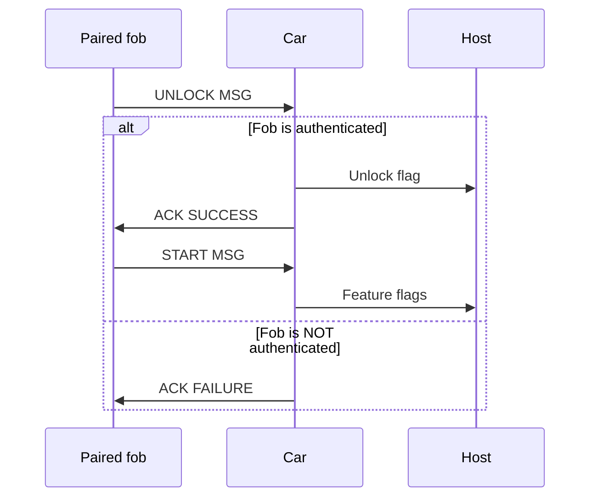
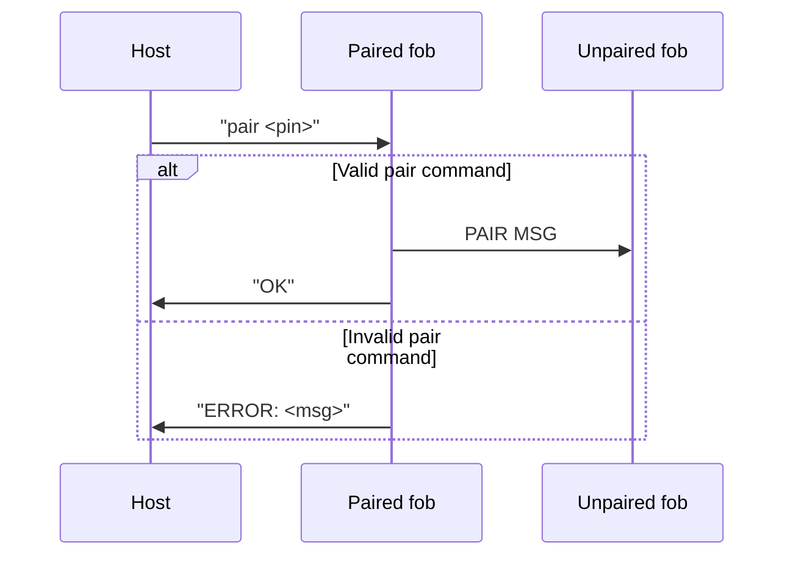
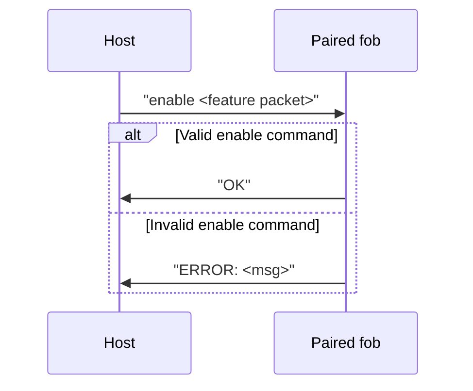

# Application Code

## Competition requirements

In the 2023 MITRE eCTF, teams were asked to provide firmware for a simulated car and key fob system. Their final deliverable needed to be able to build three images:
- Car
- Paired fob (comes "from the manufacturer" ready to unlock an associated car)
- Unpaired fob


These devices (along with, possibly, any custom host-side tools), were required to be able to do three things:

### Unlock a car

With a car, paired fob, and computer connected as shown below, pressing the on-board button should cause the car to send the "unlock" flag to the computer, along with the flags for any features that have been been enabled on the fob.


### Pair an unpaired fob

With a paired fob, unpaired fob, and computer connected as shown below, sending `pair <PIN>\n` to the paired fob should cause it to send the necessary information to the unpaired fob to let it unlock the associated car. The paired fob does not transfer its enabled features.


### Package and subsequently enable a new feature

Running the "package tool" results in a binary feature file.


With a paired fob and computer connected as shown below, sending `enable <BIN>\n` results in the fob enabling that feature. Subsequent unlock attempts with that fob will cause the car to send the associated feature flag to the attached computer.

`<BIN>` represents the contents of the previously-packaged binary feature file, encoded as ASCII hex digits (i.e. `\xA5` [`0b10100101`] would be sent as ASCII `A` `5` [`0b01000001 0b00110101`]).


## The current firmware

### Fob

Flowcharts made with [Monosketch.io](https://monosketch.io/)

#### Main flowchart

```
┌───────────┐                                                                                                       
│           │                                                        processHostCommand()                           
│           ▼                                                       ┌──────────────────────────────────────────────┐
│   ┏ ━ ━ ━ ━ ━ ━ ━ ┓ Y                                             │ ┏ ━ ━ ━ ━ ━ ━ ━ ┓  Y  ┌───────────────┐      │
│      Rec'd HOST    ───────────────────────────────────────────────┼▶ cmd == enable?  ────▶│enableFeature()│───┐  │
│   ┃   command?    ┃                                               │ ┃               ┃     │               │   │  │
│    ━ ━ ━ ━ ━ ━ ━ ━                                                │  ━ ━ ━ ━ ━ ━ ━ ━      └───────────────┘   │  │
│         N │                                                       │       N │                                 │  │
│           │                                                       │         │                                 │  │
│           ▼                                                       │         ▼                                 │  │
│   ┏ ━ ━ ━ ━ ━ ━ ━ ┓  Y  ┏ ━ ━ ━ ━ ━ ━ ━ ┓  Y  ┌───────────────┐   │ ┏ ━ ━ ━ ━ ━ ━ ━ ┓  Y  ┌───────────────┐   │  │
│        Paired?     ────▶  Btn pressed?   ────▶│attemptUnlock()│   │   cmd == pair?   ────▶│   pairFob()   ├───┤  │
│   ┃               ┃     ┃               ┃     │               │   │ ┃               ┃     │               │   │  │
│    ━ ━ ━ ━ ━ ━ ━ ━       ━ ━ ━ ━ ━ ━ ━ ━      └───────────────┘   │  ━ ━ ━ ━ ━ ━ ━ ━      └───────────────┘   │  │
│         N │                   N │                     │           │       N │                                 │  │
│           │                     └─────────────────────┤           │         │                                 │  │
│           ▼                                           │           │         ▼                                 │  │
│   ┌ ─ ─ ─ ─ ─ ─ ─ ┐  Y  ┌───────────────┐             │           │ ┌───────────────┐                         │  │
│      Rec'd c on    ────▶│receivePairData│             │           │ │ (other cmds)  ├─────────────────────────┤  │
│   │  BOARD UART?  │     │      ()       │             │           │ │               │                         │  │
│    ─ ─ ─ ─ ─ ─ ─ ─      └───────┬───────┘             │           │ └───────────────┘                         │  │
│         N │                     │                     │           └───────────────────────────────────────────┼──┘
└───────────┴─────────────────────┴─────────────────────┴───────────────────────────────────────────────────────┘   
```

#### Flowchart for enableFeature()

```
┏ ━ ━ ━ ━ ━ ━ ━ ┓ N    
     paired?     ─────┐
┃               ┃     │
 ━ ━ ━ ━ ━ ━ ━ ━      │
      Y │             │
        ▼             │
┏ ━ ━ ━ ━ ━ ━ ━ ┓ N   │
  rec'd len >=   ─────┤
┃  enable len?  ┃     │
 ━ ━ ━ ━ ━ ━ ━ ━      │
      Y │             │
        ▼             │
┏ ━ ━ ━ ━ ━ ━ ━ ┓ N   │
  car IDs same?  ─────┤
┃               ┃     │
 ━ ━ ━ ━ ━ ━ ━ ━      │
      Y │             │
        ▼             │
┏ ━ ━ ━ ━ ━ ━ ━ ┓ Y   │
  Feature list   ─────┤
┃    full?      ┃     │
 ━ ━ ━ ━ ━ ━ ━ ━      │
      N │             │
        ▼             │
┏ ━ ━ ━ ━ ━ ━ ━ ┓ N   │
 Feature num is  ─────┤
┃     1-3?      ┃     │
 ━ ━ ━ ━ ━ ━ ━ ━      │
      Y │             │
        ▼             │
┏ ━ ━ ━ ━ ━ ━ ━ ┓ Y   │
 Feature already ─────┤
┃    added?     ┃     │
 ━ ━ ━ ━ ━ ━ ━ ━      │
      N │             │
        ▼             │
┌───────────────┐     │
│  Add feature  │     │
│               │     │
└───────────────┘     │
        │             │
        ├─────────────┘
        │              
        ▼              
```

#### Flowchart for pairFob()

```
┏ ━ ━ ━ ━ ━ ━ ━ ┓ N    
     paired?     ─────┐
┃               ┃     │
 ━ ━ ━ ━ ━ ━ ━ ━      │
      Y │             │
        ▼             │
┏ ━ ━ ━ ━ ━ ━ ━ ┓ N   │
  rec'd pin len  ─────┤
┃  == pin len?  ┃     │
 ━ ━ ━ ━ ━ ━ ━ ━      │
      Y │             │
        ▼             │
┏ ━ ━ ━ ━ ━ ━ ━ ┓ N   │
  rec'd pin ==   ─────┤
┃     pin?      ┃     │
 ━ ━ ━ ━ ━ ━ ━ ━      │
      Y │             │
        ▼             │
┌───────────────┐     │
│ Send pair pkt │     │
│               │     │
└───────────────┘     │
        │             │
        ├─────────────┘
        │              
        ▼              
```

#### Flowchart for attemptUnlock()

```
┌ ─ ─ ─ ─ ─ ─ ─ ┐ N    
     paired?     ─────┐
│               │     │
 ─ ─ ─ ─ ─ ─ ─ ─      │
      Y │             │
        ▼             │
┌───────────────┐     │
│Send unlock msg│     │
│               │     │
└───────────────┘     │
        │             │
        ▼             │
┌ ─ ─ ─ ─ ─ ─ ─ ┐ N   │
      Rec'd      ─────┤
│ ACK_SUCCESS?  │     │
 ─ ─ ─ ─ ─ ─ ─ ─      │
      Y │             │
        ▼             │
┌───────────────┐     │
│Send start msg │     │
│               │     │
└───────────────┘     │
        │             │
        ├─────────────┘
        │              
        ▼              
```

### Car

Flowcharts made with [Monosketch.io](https://monosketch.io/)

#### Main flowchart

```
┌───────────┐                                   
│           │                                   
│           ▼                                   
│   ┏ ━ ━ ━ ━ ━ ━ ━ ┓ Y   ┌───────────────┐     
│      Rec'd HOST    ────▶│  processHost  │────┐
│   ┃   command?    ┃     │   Command()   │    │
│    ━ ━ ━ ━ ━ ━ ━ ━      └───────────────┘    │
│         N │                                  │
│           │                                  │
│           ▼                                  │
│   ┌ ─ ─ ─ ─ ─ ─ ─ ┐  Y  ┌───────────────┐    │
│      Rec'd c on    ────▶│  unlockCar()  │    │
│   │  BOARD UART?  │     │               │    │
│    ─ ─ ─ ─ ─ ─ ─ ─      └───────┬───────┘    │
│         N │                     │            │
└───────────┴─────────────────────┴────────────┘
```

#### Flowchart for unlockCar()

```
┌───────────────┐      
│Receive unlock │      
│      msg      │      
└───────────────┘      
        │              
        ▼  
┌───────────────┐      
│  Compute MAC  │      
│               │      
└───────────────┘      
        │              
        ▼             
┏ ━ ━ ━ ━ ━ ━ ━ ┓ N    
  Computed MAC   ─────┐
┃ == Rec'd MAC? ┃     │
 ━ ━ ━ ━ ━ ━ ━ ━      │
      Y │             │
        ▼             │
┏ ━ ━ ━ ━ ━ ━ ━ ┓ N   │
  Rec'd counter  ─────┤
┃ within WINDOW?┃     │
 ━ ━ ━ ━ ━ ━ ━ ━      │
      Y │             │
        ▼             │
┌───────────────┐     │
│Emit unlock flag     │
│Send ACK_SUCCESS     │
└───────────────┘     │
        │             │
        ▼             │
┌───────────────┐     │
│ Receive start │     │
│      msg      │     │
└───────────────┘     │
        │             │
        ▼             │
┏ ━ ━ ━ ━ ━ ━ ━ ┓ N   │
  car IDs same?  ─────┤
┃               ┃     │
 ━ ━ ━ ━ ━ ━ ━ ━      │
      Y │             │
        ▼             │
┌───────────────┐     │
│ Emit feature  │     │
│    flags      │     │
└───────────────┘     │
        │             │
        ├─────────────┘
        │              
        ▼              
```

### Unlock sequence diagram



```
                 Tag Len                                                         
      (UNLOCK_MAGIC)  │                                                          
                  │   │                                                           
                  ▼   ▼                                                           
               ┌────┬────┬────┬────┬────┬────┬────┬────┬────┬────┬────┬────┬────┐                          
UNLOCK MSG:    │0x56│0x0B│ ID │ Counter │                  MAC                  │                          
               └────┴────┴────┴────┴────┴────┴────┴────┴────┴────┴────┴────┴────┘                          
                                                                                  
                 Tag Len                                                          
       (START_MAGIC)  │                                                           
                  │   │                                                           
                  ▼   ▼                                                           
               ┌────┬────┬────────────────────────────┐                           
START MSG:     │0x57│0x0F│  Feature info (15 bytes)   │                           
               └────┴────┴─────────────┬──────────────┘                           
                                       │                                          
                                       ▼                                          
     ┌───────────────────┬───────────────────────────┬───────────────────────────┐
     │ Car ID (11 bytes) │# active features (1 byte) │List of features (3 bytes) │
     └───────────────────┴───────────────────────────┴───────────────────────────┘
                                                                                  
                                                                                  
                 Tag Len                                                          
         (ACK_MAGIC)  │                                                           
                  │   │                                                           
                  ▼   ▼                                                           
               ┌────┬────┬────┐                                                   
ACK MSG:       │0x54│0x01│0x01│ ◀──── ACK_SUCCESS                                 
               └────┴────┴────┘                                                   
                                                                                  
               ┌────┬────┬────┐                                                   
               │0x54│0x01│0x00│ ◀──── ACK_FAILURE                                 
               └────┴────┴────┘                                                   
```

### Pairing sequence diagram



```
                  Tag Len                                                          
         (PAIR_MAGIC)  │                                                           
                   │   │                                                           
                   ▼   ▼                                                           
                ┌────┬────┬──────────────────┬───────────────────┬──────────────┐  
 PAIR MSG:      │0x55│0x22│Car ID (11 bytes) │ Key (16 bytes)    │Pin (7 bytes) │  
                └────┴────┴──────────────────┴───────────────────┴──────────────┘  
```

### Enabling sequence diagram



```
                ┌──────────────────┬───────────────────┐                           
 FEATURE PKT:   │Car ID (11 bytes) │Feature # (1 byte) │                           
                └──────────────────┴───────────────────┘                           
```